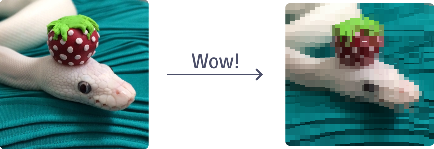

.. raw:: html

   <h1 class="blocked-header">
      Chafa, 
      now with 20% more 🐍!
   </h1>

=====
Index
=====

`Chafa <https://hpjansson.org/chafa/>`_ is a wonderful command-line utility, created by `Hans Petter Jansson`_, for visualizing images in the terminal. In Jansson's own words:
   
   **The future is (still) now!**

   The premier UX of the 21st century just got a little better: With ``chafa``, you can now view very, very reasonable approximations of pictures and animations in the comfort of your favorite terminal emulator. The power of ANSI X3.64 compels you!

chafa.py is a python wrapper for the chafa library so you can use rad graphics in your (undoubtedly pretty cool) Python applications! I mean, who wouldn't want to make this cute picture of a snake just a little more crunchy?

chafa.py tries to be very *pythonian* (I think that's a word) in the sense that most getter and setter functions are simply made to be attributes of Python objects.

Here is `the example program`_ from the Chafa C API docs written in chafa.py::

   from chafa import *
   from array import array

   PIX_WIDTH  = 3
   PIX_HEIGHT = 3
   N_CHANNELS = 4

   # Initiate pixels array ('B') for 8 bit values
   pixels = array("B", [
      0xff, 0x00, 0x00, 0xff, 0x00, 0x00, 0x00, 0xff, 0xff, 0x00, 0x00, 0xff,
      0x00, 0x00, 0x00, 0xff, 0xff, 0x00, 0x00, 0xff, 0x00, 0x00, 0x00, 0xff,
      0xff, 0x00, 0x00, 0xff, 0x00, 0x00, 0x00, 0xff, 0xff, 0x00, 0x00, 0xff
   ])

   # Specify which symbols we want
   symbol_map = SymbolMap()
   symbol_map.add_by_tags(SymbolTags.CHAFA_SYMBOL_TAG_ALL)

   # Set up a configuration with the symbols and the canvas size in characters
   config = CanvasConfig()

   config.width  = 23
   config.height = 12

   config.set_symbol_map(symbol_map)

   # Create the canvas
   canvas = Canvas(config)

   # Draw pixels and build string
   canvas.draw_all_pixels(
      PixelType.CHAFA_PIXEL_RGBA8_UNASSOCIATED,
      pixels,
      PIX_WIDTH,
      PIX_HEIGHT,
      N_CHANNELS * PIX_WIDTH
   )

   output = canvas.print().decode()

   print(output)

Take a look at the :ref:`examples` page for more cool examples. Also, here is a table of contents for these entire docs so you can sort of get a picture of what they cover and where to go:

Getting started
---------------
.. toctree::
   :maxdepth: 2
   :caption: Here are some links to get you going:

   usage/installation
   usage/tutorial
   usage/examples

API Reference
---------------
.. toctree::
   :maxdepth: 2
   :caption: If you are looking for a specific class or function, look no further:

   api/Canvas
   api/CanvasConfig
   api/SymbolMap
   api/TermDb
   api/TermInfo
   api/Loader
   api/enums

.. sidebar-links::
   :caption: External links:
   :github:
   :pypi: chafa.py
   
   Discussions <https://github.com/GuardKenzie/chafa.py/discussions>

.. _`Hans Petter Jansson`: https://hpjansson.org/
.. _`the example program`: https://hpjansson.org/chafa/ref/chafa-using.html
