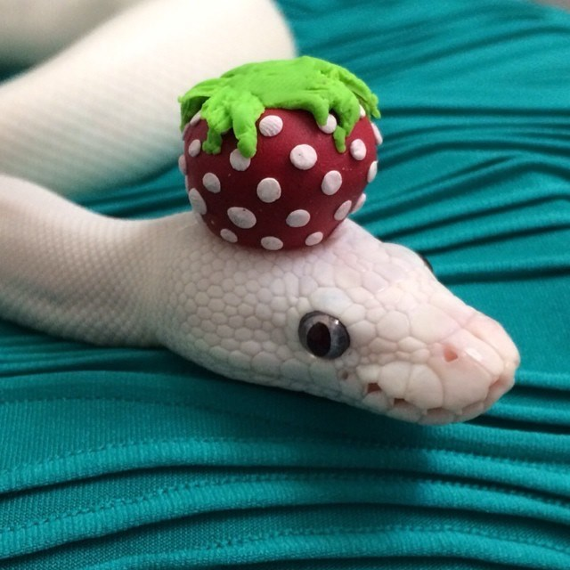

.. _examples:

========
Examples
========

On this page you will find a few useful examples (which you can also find in the `GitHub repo`_.) when it comes to using chafa.py. These should cover most of the basics for reading and printing an image and they also include some messing around with :py:class:`chafa.CanvasConfig`.

If you are the sort of person who likes getting their hands dirty right away, take a look at these and read up on the methods and classes used in the api. That should be enough to get you to a pretty good point!

All the examples will be using this image and calling it ``snake.jpg``

Some more examples might be found in the `examples folder <https://github.com/GuardKenzie/chafa.py/tree/main/examples>`_ on GitHub.

.. toctree::
   :maxdepth: 2
   :caption: Here's all the examples on the webpage.

   reading_an_image
   aspect_ratio
   detecting_capabilities
   raw_color
   emitting_control_sequences
   converting_to_html
   using_placement
   

.. _`MagickWand`: https://imagemagick.org/script/magick-wand.php
.. _`Pillow`: https://python-pillow.org/
.. _`pyvips`: https://github.com/libvips/pyvips
.. _`GitHub repo`: https://github.com/guardkenzie/chafa.py
.. _`JetBrains Mono`: https://www.jetbrains.com/lp/mono/
.. _`index`: https://chafapy.mage.black
