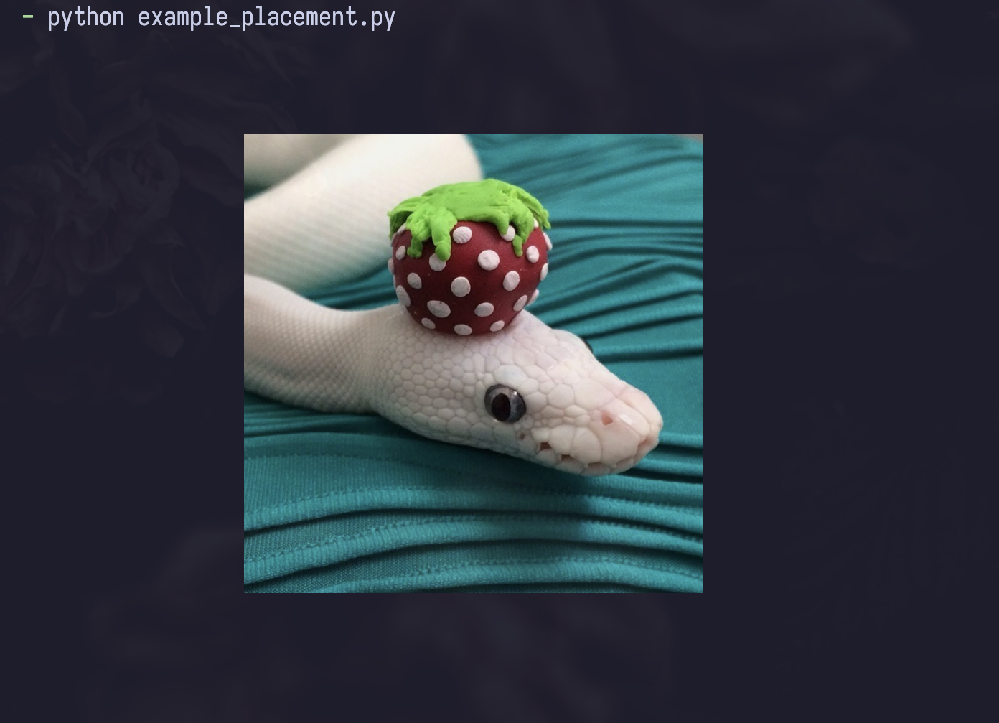

.. py:currentmodule:: chafa
===========================
Using :py:class:`Placement`
===========================

Here is an example on how to use the :py:class:`Placement` class to draw an image in the center of the :py:class:`Canvas`.

.. versionadded:: 1.2.0

::

    import chafa
    from pathlib import Path
    from PIL import Image

    # Init canvas config
    config = chafa.CanvasConfig()

    # Set canvas height and width
    config.width = 70
    config.height = 20

    # Set cell dimensions for accurate aspect ratio
    config.cell_width  = 18
    config.cell_height = 46

    # Set pixel mode
    config.pixel_mode = chafa.PixelMode.CHAFA_PIXEL_MODE_KITTY

    # Open image with PIL
    image = Image.open(Path(__file__).parent / "snake.jpg")

    width  = image.width
    height = image.height
    bands  = len(image.getbands())

    # Put image into correct format
    pixels = image.tobytes()

    # Init the canvas
    canvas = chafa.Canvas(config)

    # Init frame
    frame = chafa.Frame(
        chafa.PixelType.CHAFA_PIXEL_RGB8,
        pixels,
        height,
        width,
        width * bands
    )

    # Init image and assign our frame to it
    chafa_image = chafa.Image()
    chafa_image.frame = frame

    # Init the placement of our image
    placement = chafa.Placement(chafa_image)

    # Set our desired placement
    placement.tuck   = chafa.Tuck.CHAFA_TUCK_SHRINK_TO_FIT
    placement.halign = chafa.Align.CHAFA_ALIGN_CENTER
    placement.valign = chafa.Align.CHAFA_ALIGN_CENTER

    # Put the image on the canvas
    canvas.placement = placement

    # Write picture
    print(canvas.print().decode())