.. _tutorial:

========
Tutorial
========

Welcome to the orientation, recruit! This page is sure to get you up to speed on the latest and greatest in terminal graphics with chafa.py! Please read on and don't forget to have some fun |:heart:|

This tutorial will be using the following image of a snake (``./snake.jpg``) in all examples. It has dimensions ``640x640``.

.. image:: snake.jpg
    :width: 300
    :align: center

.. currentmodule:: chafa

Drawing an image
================

There are several steps to drawing an image. These are (hopefully) fairly straight forward once you get your mind around them.

Creating a canvas
-----------------

To output an image in the terminal, you first need :py:class:`Canvas`. The canvas is an object that functions like an actual canvas for the artist (chafa) to draw to!

Before we make a canvas, we need to configure it. This is done by creating a :py:class:`CanvasConfig` and changing it's properties::

    import chafa

    config = chafa.CanvasConfig()

    config.height = 10
    config.width  = 10

Now, when we create a :py:class:`Canvas` with the above :py:class:`CanvasConfig`, it will have width and height of 10 character cells in the terminal. This will of course affect the resolution of our image. 

Think of the artist having a canvas that is covered in a 10x10 grid. The artist then has to pick, for each of the 100 available cells, a character, a background color and a foreground color. They can't divide the cells down further.

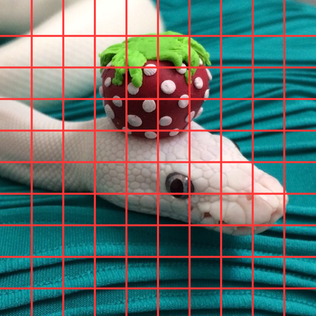

    How would you pick a character and colors for each of these cells?

You can also think of it like a monitor. A monitor with a smaller resolution will have worse, well, resolution!

After configuring our :py:class:`CanvasConfig`, we can create a :py:class:`Canvas` for drawing on::

    canvas = chafa.Canvas(config)

Loading an image
----------------

Now that we have a :py:class:`Canvas`, we need to draw to it. The chafa.py library includes a :py:class:`loader.Loader` class to help with loading images for using with chafa.

::

    from chafa.loader import Loader

    image = Loader("./snake.jpg")

The :py:class:`loader.Loader` automatically notes down the image's dimensions, calculates the images rowstride (the width of the image * the number of channels) and determines which :py:class:`PixelType` to use.

::

    print(image.width, image.height)
    print(image.rowstride)
    print(image.pixel_type)

You can also get the pixel data for the image from :py:meth:`loader.Loader.get_pixels`.

You do not need to use the included :py:class:`loader.Loader` class to load images. Check out the :ref:`examples` if you are curious about some other libraries that can be used!

Drawing to the canvas
---------------------

To draw the loaded image to our canvas, we use :py:meth:`Canvas.draw_all_pixels`. This is by far the most complicated function of this library in the terms of required parameters, but don't worry, they are easily filled out by using our :py:class:`loader.Loader`.

::

    canvas.draw_all_pixels(
        image.pixel_type,
        image.get_pixels(),
        image.width, image.height,
        image.rowstride
    )

The :py:meth:`Canvas.draw_all_pixels` expects the src_pixels array to be a 1 dimensional array where each 3 (or 4 entries if your image has an alpha channel) represent the RGB values (RGBA values) of each pixel. To tell chafa which order these 3 (or 4) values come in, you need to specify the correct :py:class:`PixelType`.

Once drawing is complete, we can get the string representation of our image with :py:meth:`Canvas.print`.

::

    output = canvas.print().decode()

    print(output)

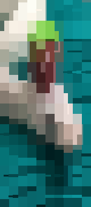

    The output of our program

Here is the full program we have so far::

    import chafa
    from chafa.loader import Loader

    # Create config
    config = chafa.CanvasConfig()

    config.height = 10
    config.width  = 10

    # Create canvas
    canvas = chafa.Canvas(config)

    # Load the image
    image = Loader("./snake.jpg")

    print(image.width, image.height)
    print(image.rowstride)
    print(image.pixel_type)

    # Draw to the canvas
    canvas.draw_all_pixels(
        image.pixel_type,
        image.get_pixels(),
        image.width, image.height,
        image.rowstride
    )

    # print output
    output = canvas.print().decode()

    print(output)

My image is not square?!
========================

.. currentmodule:: chafa

As you may have noticed, the output we got does not have the same aspect ratio as our original image. It's wayyyyy too tall. As it turns out, the character cells in our terminals are not necessarily perfectly square and chafa is oblivious to this. Thankfully there is an easy fix!

Calculating canvas geometry
---------------------------

Before we create our canvas, but after we load our image, we can use :py:meth:`CanvasConfig.calc_canvas_geometry` to calculate the width and height of our canvas based on the image's dimensions and our font ratio.

What is the font ratio you ask? Well it's nothing more than the width of the font divided by the height of the font your terminal is using. For instance, if you are using `JetBrains Mono`_, each character cell in the terminal is about 11 pixels wide and 24 pixels high. The font ratio would then be ``11/24 ≈ 0.45833...``

The :py:meth:`CanvasConfig.calc_canvas_geometry` uses the height and width of the config as a sort of bounding box so the calculated canvas geometry will not exceed those dimensions.

We will also make our canvas a little bigger to get a higher resolution image.

::

    config.width  = 30
    config.height = 30

    config.calc_canvas_geometry(
        image.width,
        image.height,
        11/24
    )

If we then print our image as before, we will get

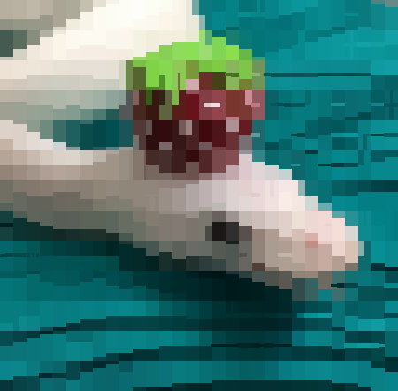

    This is a much better |:snake:|!

Kitty and Sixels
================

Chafa also has support for the Kitty and Sixels terminal image protocols. These will allow you to output images with perfect resolution in terminals which support them.

Here is the starting point of our program::

    import chafa
    from chafa.loader import Loader

    FONT_HEIGHT = 24
    FONT_WIDTH  = 11

    # Create config
    config = chafa.CanvasConfig()

    # Set geometry
    config.height = 20
    config.width  = 20

    # Load image
    image = Loader("./snake.jpg")

Kitty
-----

To output images using the Kitty image protocol, we just need to set the pixel mode to :py:attr:`PixelMode.CHAFA_PIXEL_MODE_KITTY` before creating our canvas::

    config.pixel_mode = chafa.PixelMode.CHAFA_PIXEL_MODE_KITTY

    config.calc_canvas_geometry(
        image.width,
        image.height,
        11/24
    )

    canvas = canvas(config)

Next we draw the image with :py:meth:`Canvas.draw_all_pixels` as above. We then print the image as usual::

    output = canvas.print()

    print(output.decode())

The output should look something like this

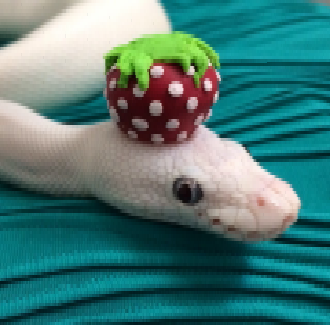

    Wait... what's with the grainy pixels?

Astute students may have noticed that the output looks pretty, well, blocky. This is because chafa does not actually know how big each character cell in our terminal is in pixels. To get a better output, we need to tell our config about that. Before we create our canvas, we can configure our cell geometry like so:

::

    config.cell_width  = 11
    config.cell_height = 24

These values will depend on which font you are using for your terminal emulator. These are based on `JetBrains Mono`_. After setting these our output will look something like this:

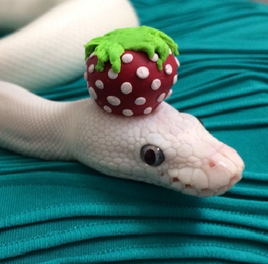

    Wow!

Sixels
------
Drawing with sixels is easier than with kitty. You will not need to use :py:meth:`CanvasConfig.calc_canvas_geometry` or set the cell geometry. We can simply set the pixel mode to :py:attr:`PixelMode.CHAFA_PIXEL_MODE_SIXELS`::

    config.pixel_mode = chafa.PixelMode.CHAFA_PIXEL_MODE_SIXELS

    canvas = canvas(config)

Next we draw the image with :py:meth:`Canvas.draw_all_pixels` as above. We then print the image as usual::

    output = canvas.print()

    print(output.decode())

The output will look something like this:

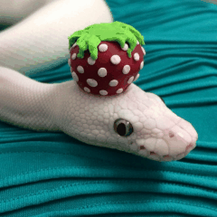

    Sixels are pretty cool!

I don't get any output from print!?
-----------------------------------

If you are trying to print an image using kitty or sixel sequences but you don't get any output, your terminal is probably not being detected correctly by :py:meth:`TermDb.detect`. Don't worry, you can still use Sixel or kitty output. You just have to add these control sequences to your terminal info. There are two ways of doing this.

Let's say you have already created a :py:class:`TermInfo` by some means (maybe using :py:meth:`TermDb.detect`). You can get a "fallback terminal info" which includes fallback sequences for kitty and sixels and supplement your terminal info with those::

    # Create fallback info
    term_db       = TermDb()
    fallback_info = term_db.get_fallback_info()

    # Create a term_info (you should probably use term_db.detect())
    term_info = TermInfo()

    # Supplement with fallback info
    term_info.supplement(fallback_info)

You can then pass this term_info to :py:meth:`Canvas.print`::

    canvas.print(term_info = term_info)

Instead of creating this term_info yourself, you can pass the optional fallback parameter to :py:meth:`Canvas.print`::

    canvas.print(fallback=True)

which will have the same effect as creating a term info with :py:meth:`TermDb.detect`, supplementing it with fallback information and then passing it to :py:meth:`Canvas.print`.

.. _`JetBrains Mono`: https://www.jetbrains.com/lp/mono/

Using symbol maps
=================

The :py:class:`SymbolMap` specifies which symbols are available to chafa when drawing an image. The symbol map is only relevant if you are using the :py:attr:`PixelMode.CHAFA_PIXEL_MODE_SYMBOLS`.

Here is the start of the program we will be using in this section::

    import chafa
    from chafa.loader import Loader

    config = CanvasConfig()

    image = Loader("./snake.jpg")

Adding symbols
--------------

The first method of adding symbols to our symbol map will be by :py:class:`SymbolTags`. Each symbol tag represents a group of symbols to make it easy to access big categories of symbols. We can add these to our map by using :py:meth:`SymbolMap.add_by_tags`::

    symbol_map = SymbolMap()

    symbol_map.add_by_tags(chafa.SymbolTags.CHAFA_SYMBOL_TAG_ALPHA)

We can then assign this symbol map to our config with :py:meth:`CanvasConfig.set_symbol_map`::

    config.set_symbol_map(symbol_map)

When we draw the image to the canvas and print it (as is explained above) we will get something like this:

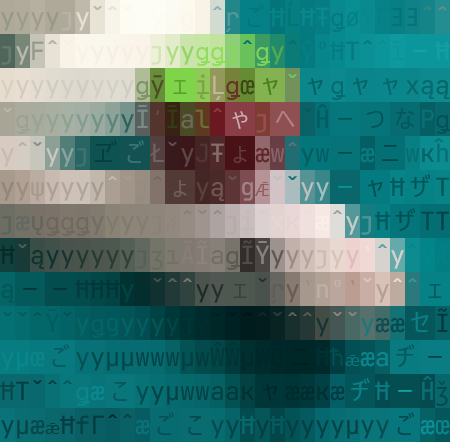

    A very alpha snake.

Next up, we can add symbols by range with :py:meth:`SymbolMap.add_by_range`. Let's say the first character of our range is ``a`` and our last character is ``f``. Then all the characters ``a,b,c,d,e,f`` will be added to the symbol map::

    symbol_map = chafa.SymbolMap()
    symbol_map.add_by_range("a", "f")

We then assign the symbol map to our config and print the image:

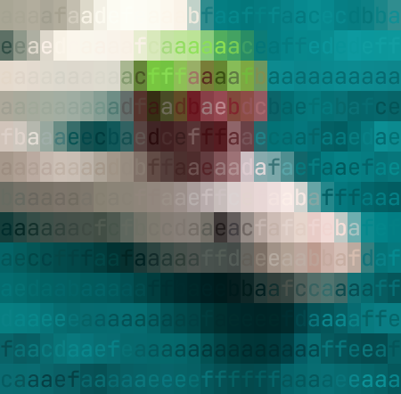

    This is very hard to make out.

The last way to add tags to the symbol map is via :py:meth:`SymbolMap.apply_selectors`. This allows you to quickly add and remove parts of symbol tags. For example: ``block,border`` sets map to contain symbols matching either of those tags. ``+block,border-dot,stipple`` adds block and border symbols then removes dot and stipple symbols::

    symbol_map = chafa.SymbolMap()
    symbol_map.apply_selectors("+block,border-dot,stipple")

Assigning the symbol map to our config and printing the image will yield:

.. figure:: tutorial_img/selector_snake.png
    :width: 300
    :align: center

    Selectors are pretty useful

Removing symbols
----------------

Removing symbols is just as simple as adding them, just use :py:meth:`SymbolMap.remove_by_tags` or :py:meth:`SymbolMap.remove_by_range`. If you want to remove with selectors, just use :py:meth:`SymbolMap.apply_selectors` with your selectors string being something that starts with ``-`` like ``-block,-stipple``.

Inspecting the canvas
=====================

You can use indexing to inspect a :py:class:`Canvas`! This can be useful if you want to get one row or column of the image or if you want to edit the colors in a certain block of the image. The indexing is done in ``y,x`` order to mimic a 2 dimensional array of pixels.

.. attention:: If the pixel mode is not set to :py:attr:`PixelMode.CHAFA_PIXEL_MODE_SYMBOLS`, inspecting the canvas in this way will yield no results.

Here is the starting program for this section::

    import chafa
    from chafa.loader import Loader

    FONT_RATIO = 11/24

    # init config
    config = chafa.CanvasConfig()

    config.height = 15
    config.width  = 15

    # Load image and init canvas
    image = Loader("./snake.jpg")

    # Set symbol map for visibility
    symbol_map = chafa.SymbolMap()
    symbol_map.add_by_tags(chafa.SymbolTags.CHAFA_SYMBOL_TAG_HALF)

    config.set_symbol_map(symbol_map)

    canvas = chafa.Canvas(config)

    # Draw to the canvas
    canvas.draw_all_pixels(
        image.pixel_type,
        image.get_pixels(),
        image.width, image.height,
        image.rowstride
    )

Characters
----------

We can inspect characters at position ``y,x`` like so::

    print(canvas[10,9].char)

We can also set this character as we would expect::

    canvas[10,9].char = "a"
    print(canvas[10,9].char)

If we print the image we will get something like this:

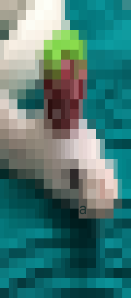

    Can you spot the "a"?

We can, of course, use slicing to set a row/column (or part of a row/column) to characters we desire::

    for pixel in canvas[3]:
        pixel.char = "-"

    for pixel in canvas[5,::3]:
        pixel.char = "V"

    i = 0
    for pixel in canvas[:-3:-1, 3]:
        pixel.char = str(i)[0]
        i += 1

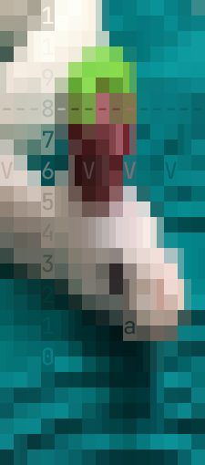

    This is very useful!

We can do the same thing with the background and foreground colors! The colors expect a tuple ``(R,G,B)`` and will return their color in the same format or they will return ``None`` if the color is transparent.

::

    for row in canvas[5:-5, 5:-5]:
        for pixel in row:
            pixel.bg_color = (25 * pixel.x, 25 * pixel.y, 0)
            pixel.fg_color = (25 * pixel.y, 25 * pixel.x, 0)

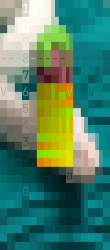

    Ok, now this is getting ridiculous!

I need more help!
=================

If you are still stuck, don't worry! Hop over to the `discussions on GitHub`_ and ask your questions there! I will try to be as helpful as I can and get you up and running!

.. _`discussions on GitHub`: https://github.com/GuardKenzie/chafa.py/discussions
